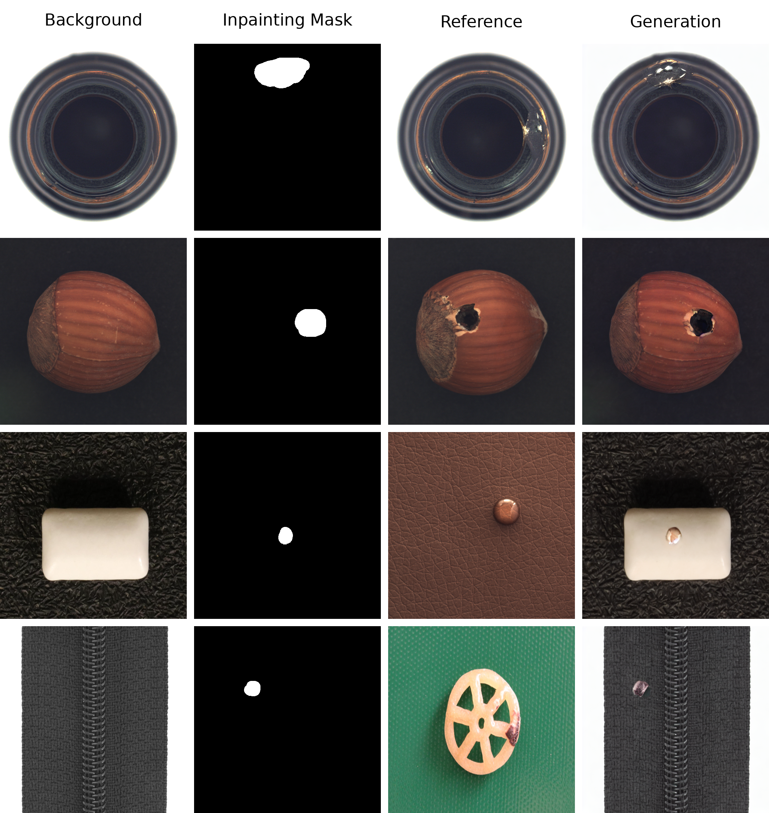
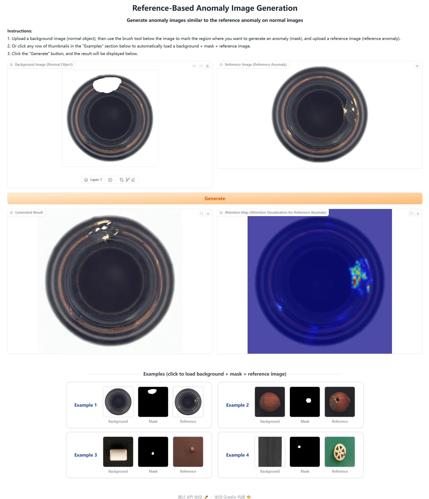
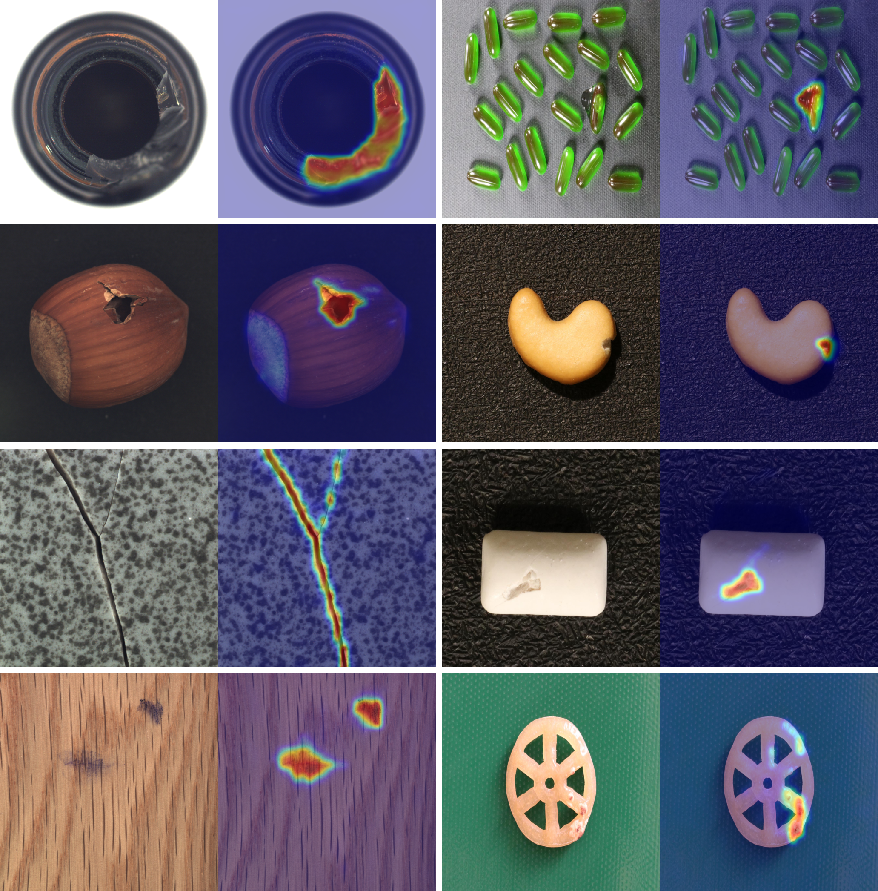

# Reference Anomaly Generation and Segmentation

**Reference-based Anomaly Image Generation via Inpainting**

This project generates realistic anomaly images by transferring defect patterns from a reference anomaly image onto a normal (background) image within a user-defined inpainting mask region. 

**Reference Anomaly Segmentation**

By analyzing the model's attention maps over the reference anomaly image, we can directly localize and segment defect regions.

## Table of Contents

- [Installation](#installation)
- [Model Checkpoints](#model-checkpoints)
- [Model Inference (Anomaly Generation)](#model-inference)
- [Gradio Web UI](#gradio-web-ui)
- [Attention Visualization (Anomaly Segmentation)](#attention-visualization)
- [Acknowledgments](#acknowledgments)


## Installation

### Prerequisites

- Python 3.10+
- [uv](https://github.com/astral-sh/uv) (for automated setup)

### Automated Setup

```bash
python prepare_environment.py
```

This will:
1. Install `uv` via pip
2. Create a Python 3.10 virtual environment in `.venv/`
3. Install all dependencies from `requirement.txt`

Then activate the environment:

```bash
source .venv/bin/activate
```

## Model Checkpoints

**No need to download them in advance**. Models are automatically downloaded from HuggingFace Hub on first inference:

| Model | Source |
|-------|--------|
| Stable Diffusion v1.5 Inpainting | `stable-diffusion-v1-5/stable-diffusion-inpainting` |
| Stable Diffusion v1.5 (for ReferenceNet) | `stable-diffusion-v1-5/stable-diffusion-v1-5` |
| CLIP ViT-H/14 Image Encoder | `laion/CLIP-ViT-H-14-laion2B-s32B-b79K` |
| Fine-tuned Checkpoint | `LiXiY/ReferenceAnomaly` |

## Model Inference

```bash
python model_inference.py \
    --background_image_path validation_images/background_image_2.png \
    --inpainting_mask_path validation_images/inpainting_mask_2.png \
    --ref_image_path validation_images/ref_image_2.png \
    --save_dir visualization_results/
```

The generated image will be saved to `visualization_results/inference_image.png`.




## Gradio Web UI

An interactive web interface is provided for easy experimentation.

```bash
python gradio_demo.py
```

The server starts at `http://localhost:7860`. Open it in your browser to access the UI.

### Workflow

1. **Upload** a normal background image via the left editor panel.
2. **Draw** the inpainting mask on the background using the brush tool (use the slider to adjust brush size).
3. **Upload** a reference anomaly image via the right panel.
4. Click **Generate** — the output image and attention map will appear below.

> **Tip:** Click any row in the "Examples" section to auto-load a complete set of inputs.



## Attention Visualization

Visualize how the model attends to the reference image during generation, We can leverage this attention mechanism to perform segmentation on reference anomaly images.

```bash
python reference_anomaly_attention_map_visualizaiton.py
```

Output is saved to `visualization_results/reference_image_attention_map.png`.



## Acknowledgments

- Built on [HuggingFace Diffusers](https://github.com/huggingface/diffusers)
- Reference attention mechanism inspired by [MagicAnimate](https://github.com/magic-research/magic-animate) and [MimicBrush](https://github.com/ali-vilab/MimicBrush)

